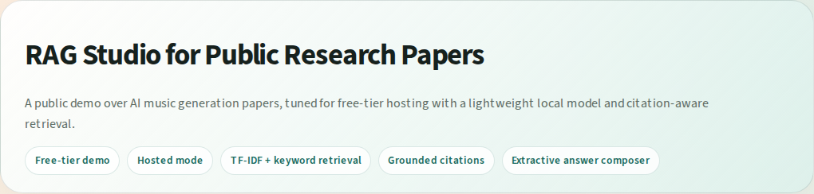
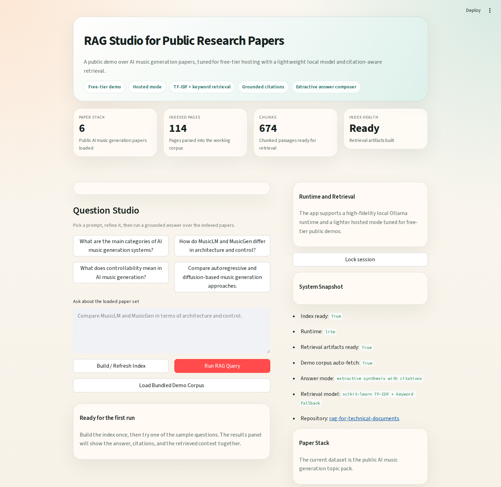
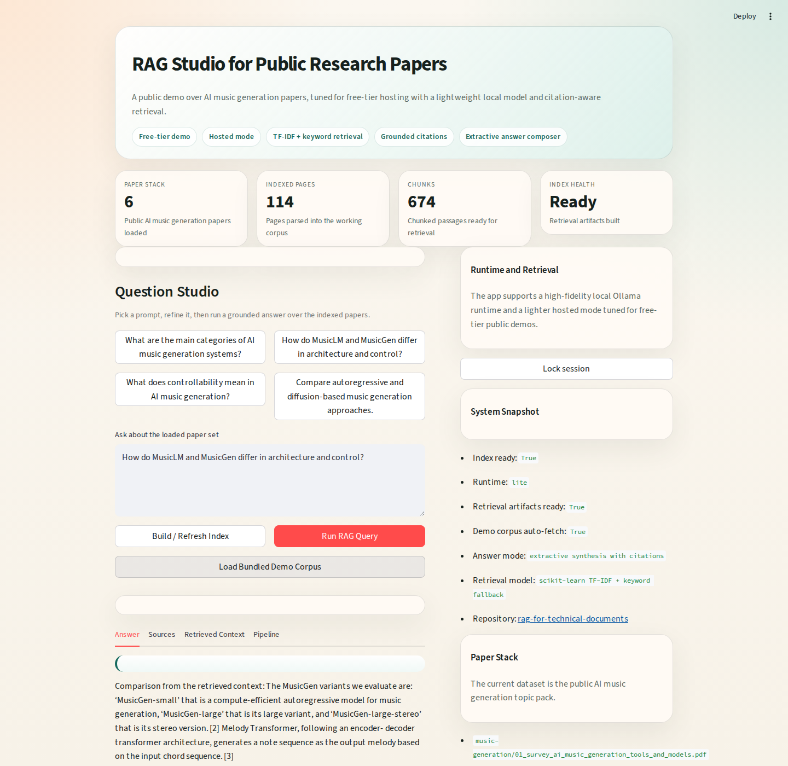
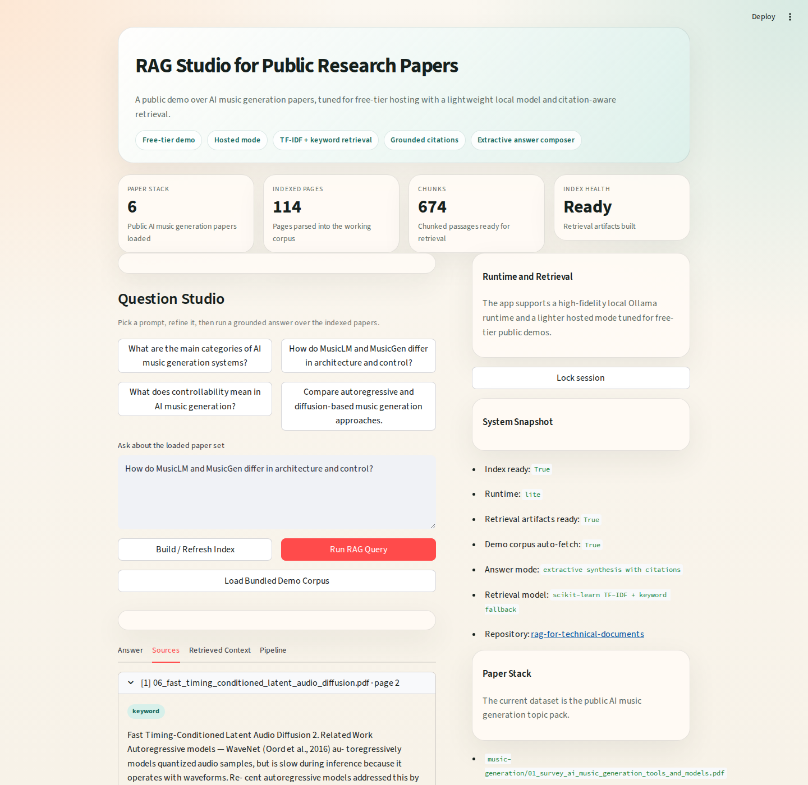
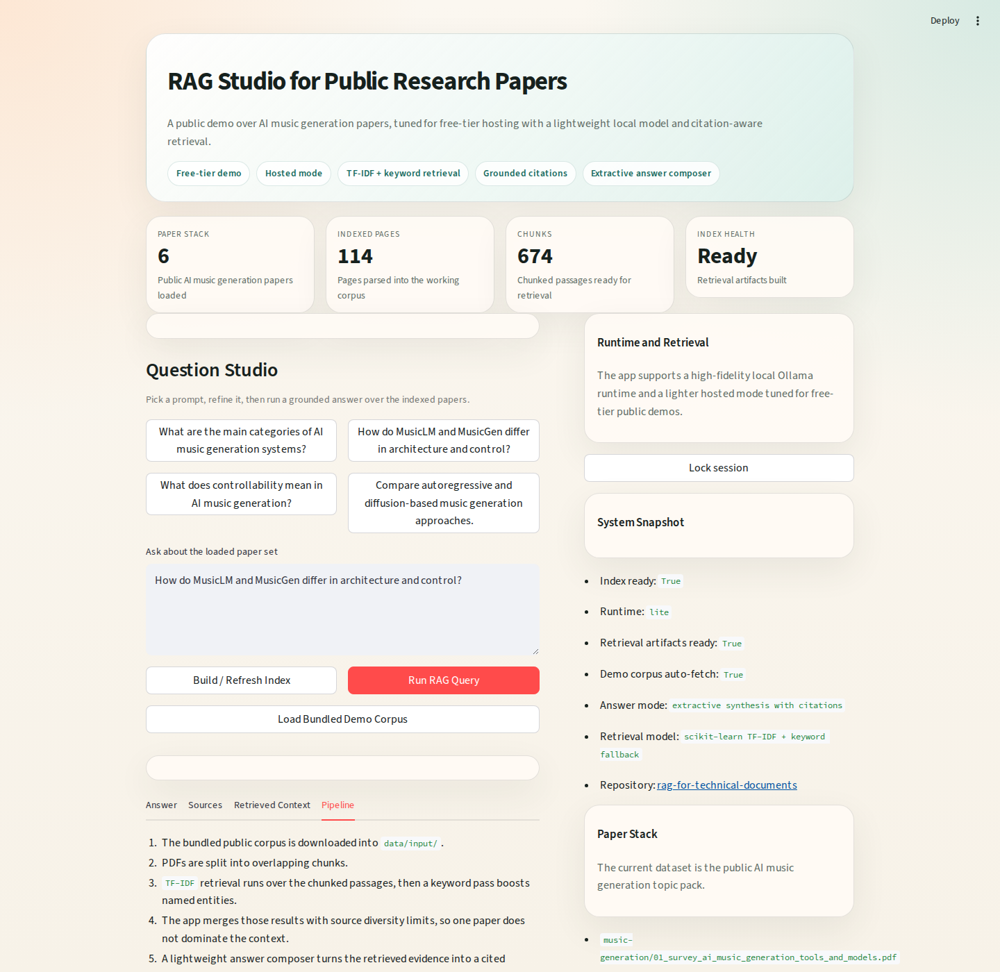

# RAG for Technical Documents

Repository: `https://github.com/msa-1988/rag-for-technical-documents`

## Overview

This project is a retrieval-augmented question answering application for public research papers. It indexes a PDF corpus, retrieves relevant evidence with a hybrid search strategy, and returns grounded answers with visible citations.

The default demo corpus is a public `AI music generation` paper set, but the application is designed for any small technical-document collection.

## Interface Preview

### Hero and product framing



### Question Studio

This is the main operator view: sample prompts, indexed-paper metrics, the current paper stack, and the controls to refresh the index or run a grounded query.



### Answer view

The answer panel shows a cited response with retrieval-signal badges, keeping the generated output visibly tied to the retrieved evidence.



### Sources view

Each cited chunk can be inspected directly, including the source PDF, page number, retrieval path, and snippet that supported the answer.



### Pipeline view

The pipeline tab makes the runtime behavior legible for demos and interviews by describing how the hosted and local modes assemble grounded answers.



## Features

- local high-fidelity runtime with `Ollama`
- free-tier hosted demo runtime for public sharing
- `ChromaDB` vector retrieval in local mode
- `TF-IDF + keyword` retrieval in hosted mode
- source diversity limits for stronger comparison answers
- citation-aware answers with inspectable context
- Streamlit interface for interactive querying

## Architecture

### Local Runtime

1. PDFs are loaded from `data/input/`
2. pages are split into overlapping chunks
3. chunks are embedded with `nomic-embed-text`
4. embeddings are stored in `ChromaDB`
5. keyword retrieval runs over exported chunks
6. vector and keyword hits are merged into a grounded context set
7. `phi3:mini` generates the final answer with citations

### Hosted Demo Runtime

1. the bundled public corpus is downloaded into `data/input/music-generation/`
2. PDFs are split into overlapping chunks
3. `TF-IDF` retrieval ranks candidate chunks
4. keyword boosting uses focused terms such as model names or controllability language
5. a lightweight answer composer turns the retrieved evidence into a cited response

## Tech Stack

- `Python`
- `Streamlit`
- `LangChain`
- `Ollama`
- `ChromaDB`
- `scikit-learn`
- `PyPDF`

## Usage

### Local Run

```bash
python3 -m venv .venv
source .venv/bin/activate
pip install -r requirements.txt
cp .env.example .env
ollama pull nomic-embed-text
./scripts/check_ollama_gpu.sh
./scripts/run_safe_local.sh
```

Then:

1. place public PDFs in `data/input/`
2. open `http://localhost:8501`
3. click `Build / Refresh Index`
4. ask questions about the indexed papers
5. inspect the answer, sources, and retrieved context

### Free-Tier Hosted Demo

This repository is configured for a public interviewer demo on `Streamlit Community Cloud`.

Use these deployment settings:

1. Repository: `msa-1988/rag-for-technical-documents`
2. Branch: `main`
3. Entrypoint file: `app/streamlit_app.py`
4. Python version: `3.12`
5. Variables:
   - `RAG_RUNTIME=lite`
   - `DEMO_AUTO_FETCH=true`

The hosted demo uses only public papers and does not require local Ollama.

### Validation

```bash
python3 scripts/smoke_test_pipeline.py
```

## Public Demo

The project supports two public-sharing paths:

- `Streamlit Community Cloud` for a durable free-tier demo using `RAG_RUNTIME=lite`
- a password-protected local tunnel for short-lived private demos from your own machine

Configured Streamlit deployment URL:

- `https://rag-for-technical-documents-ad2b7s6o2njvumzteywaca.streamlit.app/`

Before sharing the hosted link publicly, confirm the Streamlit Community Cloud visibility setting allows anonymous access.

If you need the short-lived local demo path:

```bash
./scripts/start_secure_public_demo.sh
```

## Repository Layout

- `app/`: Streamlit app and pipeline code
- `data/demo_corpus/`: bundled public paper manifest for hosted demos
- `data/input/`: local PDF input folder, not tracked in Git
- `scripts/`: runtime, validation, and demo helpers
- `.streamlit/config.toml`: safe local server defaults

## Security

- the app binds to `127.0.0.1` by default
- `data/input/` is git-ignored
- no private or personal documents are included in the repository
- free-tier hosted demos use only public papers
- local public sharing is opt-in and password-protected
